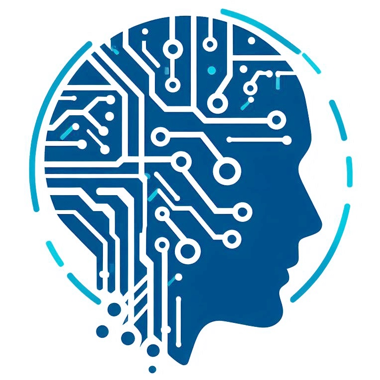
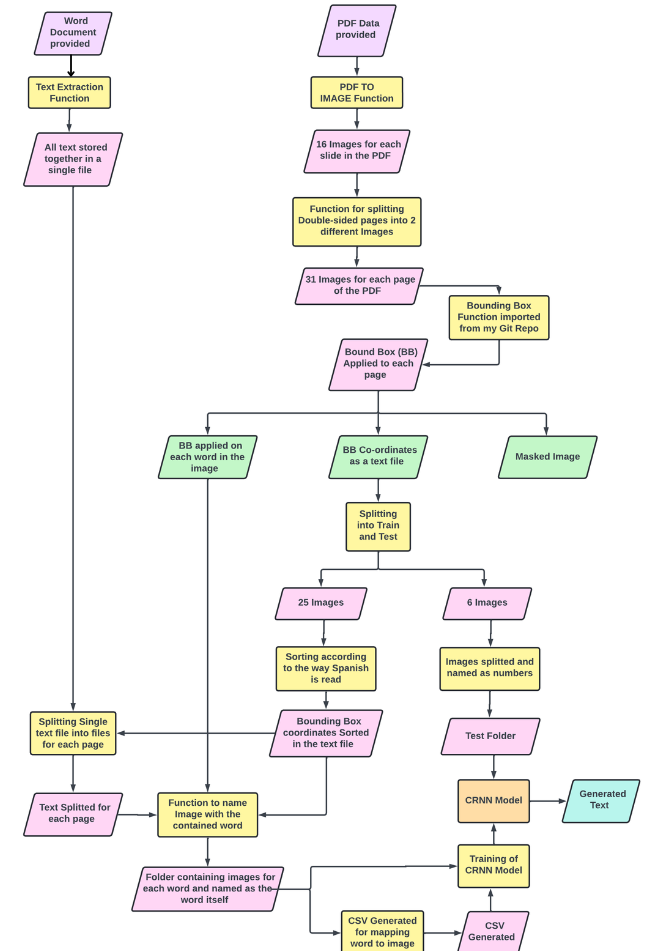
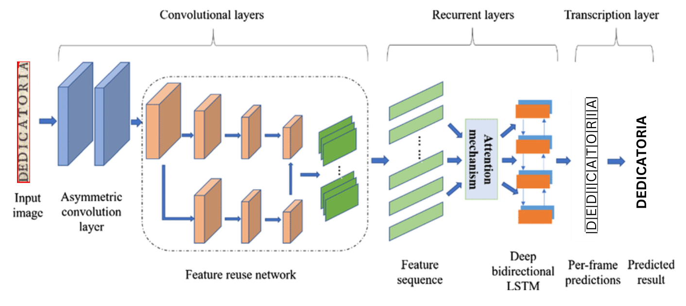
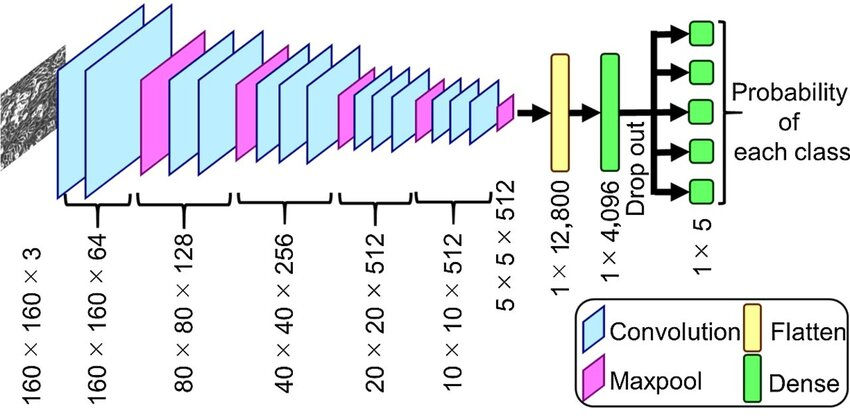

# Historical Text Recognition using CRNN Model

This project aims to address the challenge of text recognition from `historical Spanish printed sources` dating back to the `seventeenth century`, a domain where existing Optical Character Recognition (OCR) tools often fail due to the complexity and variability of the texts. Leveraging hybrid end-to-end models based on a combination of CNN and RNN architectures, namely `CNN-RNN`, our research seeks to develop advanced machine learning techniques capable of accurately transcribing non-standard printed text. This project is a part of the `RenAIssance project`, a large project under the HumanAI organization. I am `Shashank Shekhar Singh`, a second year student from `IIT BHU, India` and have been developing this project as a part of the `Google Summer of Code program' 2024`.

  
  

## Table of Contents

- [Project Goals](#Project-Goals)
- [Installation](#installation)
- [About The Project](#About-The-Project)
- [Datasets and Models](#datasets-and-models)
- [Acknowledgements](#acknowledgements)
- [License](#license)
- [Links](#links)

## Project Goals

1. **Development of Hybrid End-to-End Models:** The primary goal of this project is to design, implement, and fine-tune hybrid end-to-end models
based on CRNN architectures for text recognition. By combining the strengths of architectures such as recurrent neural networks (RNN) and convolutional neural networks (CNN), the models aim to effectively capture both local and global features in the historical Spanish printed text enhancing accuracy and robustness in transcription.
2. **Achieving High Accuracy:** The ultimate objective is to train machine
learning models capable of extracting text from seventeenth-century
Spanish printed sources with at least **80%** accuracy. This entails extensive experimentation, hyperparameter tuning, and dataset curation to ensure the models generalize well across various styles, fonts, and degradation levels present in historical documents. Achieving this goal will signify a significant advancement in text recognition, particularly in the context of preserving and analyzing ancient textual artifacts.

## Installation

You don't need to install anything externally, just fire up the python notebook on your favourite coding platform (Google Colab, Jupter Notebook, Kaggle etc) and start running the cells one after the other.

## About The Project

#### Irregularities and Ambiguities
- **Interchangeable Characters**: Characters like 'u' & 'v', and 'f' & 's' were used interchangeably. Assume 'u' at the beginning of word and 'v' inside word. Assume 's' at the beginning/end of a word, 'f' within a word.
- **Tildes (horizontal “cap” – ignore grave/backwards accents)**: 
1. When a q is capped, assume ue follows
2. When a vowel is capped, assume n follows
3. When n is capped, this is always the letter ñ
- **Old Spellings**: ç old spelling is always modern z.
- **Line End Hyphens**: Some line end hyphens not present. Leaving words split for now.

#### Dataset and Pre-processing
- **Input Data:** The main dataset consists of 31 scanned pages: 25 have transcriptions available, the last 6 pages of transcriptions have been removed to later evaluate the degree of accuracy and viability of the test method employed.
- **PDF and DOC to Images Folder**: This flowchart depicts the path followed to generate the dataset for training the CRNN Model.

- **CRAFT Model**: The CRAFT model for Bounding Box Detection and Localisation gives the following results.
    

    
    
    

- **Enhancements**: Augmentation techniques like rotation and Gaussian noise addition.

#### Model Architecture
- **CRNN Model**: The Convolutional Recurrent Neural Networks is the combination of two of
the most prominent neural networks. The CRNN (convolutional recurrent
neural network) involves CNN (convolutional neural network) followed by
the RNN (Recurrent neural networks).

- ***CNN***: CNNs are used for extracting spatial features from input images, transforming them into a feature map.

- ***RNN***: RNNs then process these sequentially to capture contextual dependencies and predict character sequences.

#### Training and Evaluation
- **Hyperparameter Optimization**: Selection through vast amount of experimentation.
- **Model Calibration**: Utilizes margin loss and other techniques to align sequence likelihoods with quality, improving output accuracy.
- **Evaluation Metrics**: Performance evaluated using CTC Loss and Validation loss.

For a detailed walkthrough of the project's development, challenges, and solutions, read the complete blog post [here](https://utsavrai.substack.com/p/a-journey-into-historical-text-recognition).

## Datasets and Models
- The `Padilla - Nobleza virtuosa_testExtract.pdf` can be downloaded from [here](http://drive.google.com/uc?id=10NX_UbV2HMbPEO2fvKYAIXOOOec0g38g) 
- The `Padilla - 1 Nobleza virtuosa_testTranscription.docx` can be downloaded from [here](http://drive.google.com/uc?id=1YTaqNoZCYP74AuQxlyJsiQLhcoc8DNSv) 
- The ocr model used can be directly generated by running the python notebook or can be downloaded from [here](githublink)

## Model Performance

| Metric | Value |
|--------|-------|
| CTC Loss | 0.0075 |
| Validation Loss | 5.6956e-04 |

## Acknowledgements

This project is supported by the [HumanAI Foundation](https://humanai.foundation/) and Google Summer of Code 2024. Detailed documentation and a journey of this project can be found on my [blog post](blogpost).

## License

This project is licensed under the MIT License. See the [LICENSE](LICENSE) file for details.

## Links

- [Google Summer of Code 2024 Project](https://summerofcode.withgoogle.com/programs/2024/projects/lg7vQeMM)
- [HumanAI Foundation](https://humanai.foundation/)

Feel free to fork the repository and submit pull requests. For major changes, please open an issue to discuss your ideas first. Contributions are always welcomed!