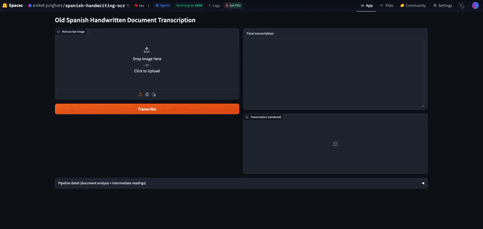
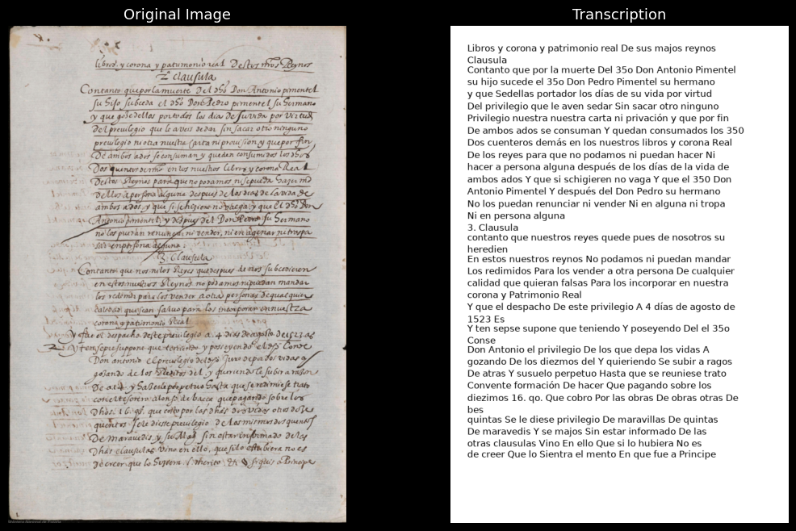
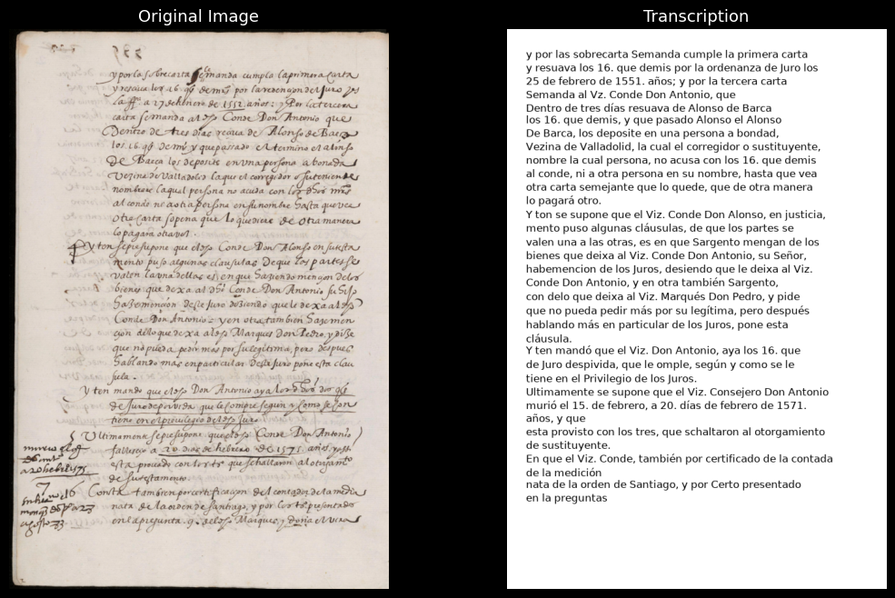
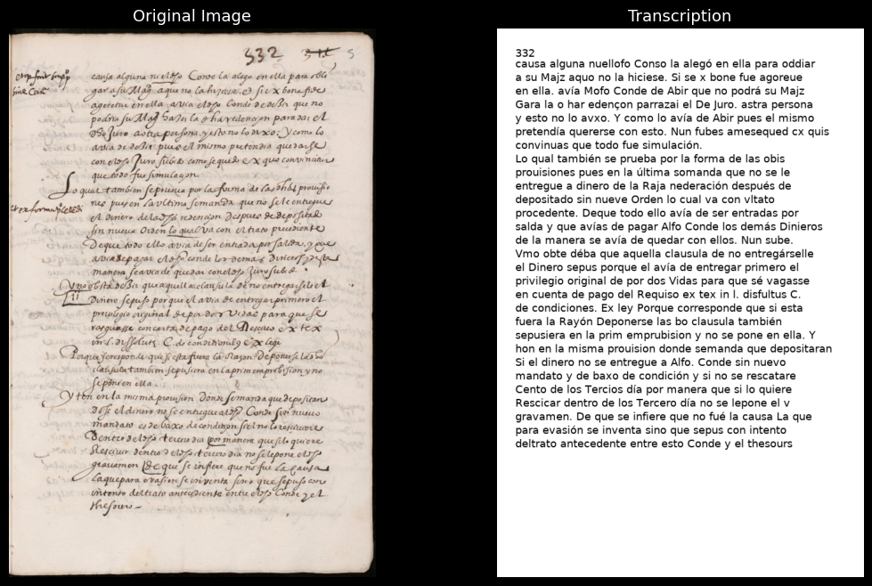

# End-to-end handwritten text recognition for early modern Spanish documents with Vision-Language Model pipeline creation

**GSoC 2026 Final Submission**

[](https://huggingface.co/spaces/aniket-junghare/spanish-handwriting-ocr)
[](https://huggingface.co/aniket-junghare/qwen2.5-vl-spanish-ocr-lora)
[](LICENSE)

📄 **Blog posts:** [Midterm Update](https://medium.com/@aniketjunghare999/building-an-end-to-end-vlm-driven-pipeline-for-reading-early-modern-spanish-handwriting-gsoc-2026-b307b89f5c92) · [Final Update](https://medium.com/@aniketjunghare999/end-to-end-handwritten-text-recognition-for-early-modern-spanish-documents-with-vision-language-6d455fe35d92)

---

## **Abstract**

This project focuses on building an ***end-to-end Handwritten Text Recognition (HTR) pipeline*** for ***early modern Spanish manuscripts*** by placing a ***Vision-Language Model (VLM)*** at the center of every processing stage, rather than using it as a late-stage corrector. The system leverages ***Qwen2.5-VL-7B-Instruct*** with ***LoRA-based fine-tuning*** across a ***multi-task training strategy***, teaching the model both to ***faithfully read handwriting*** and to ***produce clean, corrected transcriptions***. A ***fine-tuned MIM-TrOCR model***, developed during ***GSoC 2025***, provides ***supplementary line-level evidence*** via ***OpenCV-based line segmentation***. The pipeline operates through ***four distinct stages***: ***document analysis***, ***line-level OCR***, ***literal reading***, and ***reconciliation/correction***, enabling robust transcription of ***degraded historical manuscripts***. Evaluated on the ***Rodrigo***, ***Orinoco***, and ***Tridis*** datasets, the system achieves competitive results. In the final phase of the project, the pipeline was also packaged into a ***publicly hosted, open-source web application***, deployed on ***Hugging Face Spaces***, making the tool usable directly from a browser with no local setup, contributing to the development of ***VLM-driven pipelines*** for ***historical document analysis*** and the ***digital preservation*** of ***Renaissance textual heritage***.

---
## **Try It Now**

A live, interactive version of the pipeline is hosted on **Hugging Face Spaces**:

**🔗 [huggingface.co/spaces/aniket-junghare/spanish-handwriting-ocr](https://huggingface.co/spaces/aniket-junghare/spanish-handwriting-ocr)**

Upload a scanned manuscript image and get a full transcription, with intermediate pipeline stages (document analysis, preliminary readings) viewable alongside the final result. No installation required, runs on Hugging Face's free ZeroGPU tier.

<p align="center">
  
</p>

---

##  **Approach**

### **1. Data Preparation**
- **Training Data**: Handwritten manuscript images and their corresponding ***ground-truth transcriptions***, provided by the project mentors, are used for ***fine-tuning***. Each image is paired with ***two complementary prompts***: (a) a ***literal reading prompt*** instructing the model to transcribe handwriting as it is, and (b) a ***corrected transcription prompt*** instructing the model to produce clean, error-free output. This dual-prompt structure ensures the model learns both ***faithful reading*** and ***intelligent correction***.
- **Evaluation Data**: The pipeline is evaluated on the ***Rodrigo***, ***Orinoco***, and ***Tridis*** datasets, containing diverse handwriting styles, archaic letterforms, and complex page layouts. Each evaluation image is paired with its ***ground-truth transcription*** for computing ***CER*** and ***WER*** metrics.

### **2. Fine-Tuning**
- ***LoRA-based fine-tuning*** (rank=16, alpha=32) is applied to ***Qwen2.5-VL-7B-Instruct*** for ***parameter-efficient adaptation*** on handwritten document images.
- ***Multi-task training*** with two complementary prompts per image teaches the model both to ***faithfully read handwriting*** and to ***produce clean, corrected output***.
- Training prompts are designed to ***exactly match inference prompts***, ensuring consistency between training and deployment.
- **Training Prompts**:

  **Prompt 1 : Literal Reading:**
  ```
  Transcribe every line of handwritten text in this image exactly as it appears.
  Strict rules:
  - Copy each word precisely as written, no spelling corrections, no modernisation.
  - Preserve the EXACT capitalisation of every letter as it appears in the manuscript
  (a capital in the middle of a sentence must stay capital; a lowercase must stay lowercase).
  - Do NOT expand or interpret abbreviations. Words with superscript letters
  (e.g. 'dho', 'dha', 'q̃', 'p̃') must be copied as-is, superscript letters are
  abbreviation markers, never digits or numbers.
  - CRITICAL: In this script, the letters 'd' and 'h' can resemble '3' and '5'.
  Never write '35o', '35a', '35os', '35as', the correct forms are
  'dho', 'dha', 'dhos', 'dhas'.
  - Output only the transcribed text, line by line.
  ```

  **Prompt 2 : Corrected Transcription:**
  ```
  Using the image, produce the final accurate transcription. Fix only genuine misread
  characters that are clearly contradicted by the visual evidence in the image.

  IMPORTANT constraints:
  - Do NOT modernise spelling, vocabulary, or grammar. Keep all historical and
  archaic forms exactly as written.
  - Preserve the EXACT capitalisation from the manuscript, do not change a
  capital letter to lowercase or vice versa, even in the middle of a sentence.
  - Do NOT expand abbreviations. Copy them as they appear: 'dho', 'dha', 'Dho',
  'Dha', 'dhos', 'dhas', 'q̃', 'p̃', etc.
  - CRITICAL misread to fix: In this script, 'd' resembles '3' and 'h' resembles '5'.
  If you see '35o', '35a', '35os', or '35as', these are ALWAYS misreads of
  'dho', 'dha', 'dhos', 'dhas' respectively. Correct every occurrence.
  - Preserve the line and paragraph structure of the document.
  Provide ONLY the final corrected transcript, nothing else.
  ```

  
  These prompts are used verbatim (unchanged) as the literal-reading and correction-pass prompts in `inference.py` and `app/app.py`, ensuring training and inference stay in the same distribution.

- **Training Configuration**: batch size 1, gradient accumulation 2, learning rate 1e-5, 10 epochs, bf16 mixed-precision training.
- **Hardware**: NVIDIA A40/A100 GPUs via SLURM cluster.

### **3. Inference Pipeline Architecture**
The full local inference pipeline processes each document page through ***four stages***, with the ***VLM used at every stage*** and ***TrOCR providing supplementary evidence***:

| **Stage** | **Purpose** | **Description** |
|-----------|-------------|-----------------|
| **Stage 1** | Document Analysis | VLM identifies ***language***, ***time period***, ***legibility***, and ***special features*** of the handwritten page |
| **Stage 2a** | Line-Level OCR | TrOCR processes individual text lines extracted via ***OpenCV horizontal projection line segmentation*** |
| **Stage 2b** | Literal Reading | VLM reads the handwriting ***as it is***, line by line, without corrections (prompt aligned with fine-tuning) |
| **Stage 3** | Reconciliation & Correction | VLM ***reconciles both readings*** (TrOCR + VLM literal) using Stage 1 ***document analysis context*** and the ***original image*** as visual evidence, ***correcting errors***, ***archaic abbreviations***, and producing the ***final transcription*** |

The deployed web app runs the same architecture with Stage 2a (TrOCR) made optional, defaulting to a 3-stage VLM-only pipeline for responsiveness under shared GPU quota constraints.

### **4. Line Segmentation**
- ***OpenCV horizontal projection profiles*** are used to segment full manuscript page images into ***individual text lines***.
- Segmented line images are passed to ***TrOCR*** (a line-level model) for ***independent OCR***, producing per-line transcription candidates.
- This ***classical CV approach*** is robust, dependency-free, and works reliably across diverse manuscript layouts.

### **5. Decoding and Output Generation**
- ***Beam search decoding*** (4 beams) with ***repetition penalty*** (1.2) and ***n-gram blocking*** (no_repeat_ngram_size=10) to prevent the VLM from looping on difficult images.
- Produces ***visual transcription images***: predicted text rendered onto white pages matching ***original document dimensions*** for side-by-side comparison.
- Outputs ***structured results*** containing all intermediate outputs: document analysis, literal reading, TrOCR output, and final reconciled transcription.

### **6. Evaluation**
- The evaluation script runs the ***same pipeline*** on images with ground truth.
- Computes ***Character Error Rate (CER)*** and ***Word Error Rate (WER)*** per image using the ***jiwer*** library.
- Outputs a ***detailed CSV*** with all intermediate outputs per image and a ***summary statistics table***.

### **7. Deployment**
- The pipeline is packaged as a ***Gradio web application*** and deployed on ***Hugging Face Spaces*** using the ***ZeroGPU*** hardware tier (a shared pool of GPUs allocated per-request, free for public use).
- Only the ***LoRA adapter weights*** (a few hundred MB) are hosted separately on the Hugging Face Hub; the ***16GB base model*** streams directly from `Qwen/Qwen2.5-VL-7B-Instruct` at runtime, keeping the deployment lightweight and avoiding duplication of the base model.
- ZeroGPU quota is billed ***per visitor***, not per Space owner, so usage by any visiting user draws from their own account's quota rather than the repository owner's.

##  **Evaluation Metrics**

To evaluate the performance of the ***HTR pipeline***, two standard metrics are used:

### **Character Error Rate (CER)**
- CER measures the ***character-level edit distance*** between the predicted transcription and the ground truth, normalized by the length of the ground truth.
- A ***lower CER*** (closer to `0.0`) indicates higher transcription accuracy at the character level.
- CER captures fine-grained errors such as ***misrecognized letterforms***, ***missing diacritics***, and ***character substitutions*** common in historical handwriting.

### **Word Error Rate (WER)**
- WER measures the ***word-level edit distance*** between the predicted and ground truth transcriptions, normalized by the number of words in the ground truth.
- A ***lower WER*** (closer to `0.0`) indicates that the model produces transcriptions with fewer ***word-level errors***, including ***insertions***, ***deletions***, and ***substitutions***.
- WER is particularly important for ***downstream usability***, as word-level accuracy directly impacts the readability and utility of transcribed manuscripts for ***historians*** and ***linguists***.

Both metrics are computed per image and aggregated across the full dataset to provide ***best***, ***average***, ***median***, and ***worst-case*** performance statistics.

---

##  **Results Analysis**

### **Rodrigo Dataset**

| **Metric** | **Best (Min)** | **Average** | **Median** | **Worst (Max)** |
|-----------|----------------|-------------|------------|-----------------|
| **CER** | 0.000000 | 0.135706 | 0.107143 | 1.563636 |
| **WER** | 0.000000 | 0.460671 | 0.428571 | 1.454545 |

<br>

### **Orinoco Dataset**

| **Metric** | **Best (Min)** | **Average** | **Median** | **Worst (Max)** |
|-----------|----------------|-------------|------------|-----------------|
| **CER** | 0.091658 | 0.908369 | 0.281682 | 6.250000 |
| **WER** | 0.320988 | 0.855477 | 0.584654 | 7.022727 |

<br>

### **Tridis Dataset**

| **Metric** | **Best (Min)** | **Average** | **Median** | **Worst (Max)** |
|-----------|----------------|-------------|------------|-----------------|
| **CER** | 0.000000 | 0.550386 | 0.565789 | 2.368421 |
| **WER** | 0.000000 | 0.881366 | 1.000000 | 2.600000 |

---

## **Evaluation Summary**

### **Rodrigo Dataset**
The best CER of ***0.000000*** on multiple images indicates that the pipeline achieves ***perfect transcription*** on well-preserved pages with clear handwriting. The median CER of ***0.107143*** demonstrates that the pipeline consistently produces usable transcriptions across the majority of the 5010 image dataset, with ***approximately 89.3% character-level accuracy*** at the median. The median WER of ***0.428571*** reflects the challenge of historical handwriting at the word level, where ***archaic abbreviations***, ***irregular spacing***, and ***connected letterforms*** make word boundary detection difficult. The worst-case CER of 1.563636 corresponds to severely degraded or atypical pages where the model struggles, indicating room for improvement with ***larger VLM backends***.

### **Orinoco Dataset**
The Orinoco dataset represents a ***more challenging out-of-distribution*** evaluation. The best CER of ***0.091658*** shows the pipeline can achieve strong results even on this harder dataset. The median CER of ***0.281682*** and median WER of ***0.584654*** indicate that while the pipeline establishes a ***working baseline***, there is significant room for improvement. The high average CER (0.908369) is skewed by a small number of extremely difficult pages. These results directly motivate the ***multi-model approach*** proposed for GSoC, where ***larger and more capable VLM backends*** are expected to substantially improve performance on challenging manuscripts.

### **Tridis Dataset**
The Tridis dataset presents a ***distinct challenge*** with its mix of handwriting styles and document conditions. The best CER of ***0.000000*** confirms that the pipeline can achieve ***perfect transcription*** on certain well-preserved pages. However, the median CER of ***0.565789*** and median WER of ***1.000000*** indicate that the majority of images in this dataset are ***significantly harder*** than Rodrigo, likely due to ***greater variability in handwriting styles***, ***document degradation***, and ***limited overlap with the training distribution***. The average CER of ***0.550386*** reflects consistent difficulty across the dataset, unlike Orinoco where a few extreme outliers skewed the average. These results highlight the importance of ***expanded fine-tuning data*** and ***larger VLM backends*** to improve generalization across diverse manuscript collections.

### **Real-World User Testing**
Beyond benchmark datasets, the deployed web app was tested directly by two independent reviewers. Both reported smooth setup and "very workable" transcription quality on real manuscript images. Feedback surfaced two concrete error patterns for future work: occasional confusion between visually similar characters (lowercase 'r', and 'u'/'v'), likely reflecting a training data coverage gap, and a subtler failure where a word split across a line break was transcribed as a different, shorter word (e.g. *"atrevimiento"* read as *"atrevido"*). A prompt-level fix targeting the line-break issue has been added to the correction stage as an initial mitigation, pending further validation.

---

##  **Sample Transcription Results**

<p align="center">
  
</p>

<p align="center">
  
</p>

<p align="center">
  
</p>

> All image outputs are available in the [`results/Model_output/`](results/Model_output/) folder.

---

## **Key Design Decisions**

### **1. VLM at All Stages**
The VLM is not merely a late-stage post-processor. It drives ***every stage*** of the pipeline: document analysis, literal reading, and reconciliation/correction. This satisfies the core requirement of the project and enables the model to leverage ***visual context*** throughout the entire transcription process.

### **2. TrOCR as Supplementary OCR**
The ***fine-tuned MIM-TrOCR model***, developed during ***GSoC 2025***, provides an ***independent line-level reading*** that the VLM can cross-reference during correction. Critically, the pipeline ***works fully without TrOCR***, ensuring robustness when line segmentation fails or TrOCR is unavailable. This is also why the deployed web app can run the leaner 3-stage version by default.

### **3. Multi-Task Fine-Tuning**
Training with ***two complementary prompts per image*** (literal reading + corrected transcription) teaches the model distinct skills. The training prompts ***exactly match inference prompts***, ensuring consistency and preventing distribution shift between training and deployment.

### **4. Repetition Control**
Historical manuscripts with repetitive patterns or degraded regions can cause VLMs to enter ***output loops***. The combination of ***no_repeat_ngram_size=10*** and ***repetition_penalty=1.2*** effectively prevents this while preserving the model's ability to produce legitimate repeated text.

### **5. Classical Line Segmentation**
The ***OpenCV horizontal projection profile*** approach for line segmentation is chosen for its ***robustness***, ***simplicity***, and ***zero training data requirement***. It reliably segments diverse manuscript layouts without introducing additional model dependencies.

### **6. Lightweight, Reproducible Deployment**
Only the LoRA adapter is hosted as a deployable artifact; the base model is never re-uploaded or duplicated. This keeps the deployment small, makes the adapter independently reusable by others, and demonstrates parameter-efficient fine-tuning as a practical deployment strategy, not just a training-time optimization.

---

##  **Future Improvements**

### **1. Multi-Model VLM Support**
Integrate ***multiple open-source VLM backends*** including larger ***Qwen2.5-VL variants*** (3B, 72B), ***InternVL***, and other competitive models, allowing users to trade off between ***speed*** and ***accuracy*** based on their hardware.

### **2. Batch Processing for Multi-Page Manuscripts**
Add support for processing ***entire multi-page manuscripts*** in a single run, with ***PDF input support***, ***automatic page ordering***, ***per-page error recovery***, and ***consolidated output*** in multiple formats. Deliberately deferred for the hosted web app specifically, since multi-page PDF support would multiply GPU load per document and conflicts with staying responsive under the free ZeroGPU tier's quota.

### **3. Improved Line Segmentation**
Augment the classical OpenCV approach with a ***learned segmentation model*** for improved robustness on documents with ***marginalia***, ***annotations***, and ***multi-column layouts***.

### **4. Expanded Dataset Coverage**
Fine-tune and evaluate across a broader range of ***historical manuscript collections*** from ***BNE***, ***Europeana***, and other digital archives to improve ***generalization*** across diverse handwriting styles and document conditions.

### **5. Multilingual Adaptation**
Extend the pipeline to support ***other historical languages and scripts*** beyond Spanish, leveraging the ***multilingual capabilities*** of modern VLMs.

### **6. Character-Level Accuracy Improvements**
Address the r/u/v confusion patterns identified during real-world testing by expanding fine-tuning data coverage for visually similar character pairs in the source script.

---

##  **Tech Stack**

| **Component** | **Tool / Library** |
|---------------|-------------------|
| VLM | Qwen2.5-VL-7B-Instruct + LoRA (PEFT) |
| OCR | Fine-tuned MIM-TrOCR (line-level recognition, developed during GSoC 2025) |
| Line Segmentation | OpenCV horizontal projection profiles |
| Metrics | Character Error Rate (CER), Word Error Rate (WER) |
| Web App | Gradio, deployed on Hugging Face Spaces (ZeroGPU) |
| Hardware (Training/Eval) | NVIDIA A40/A100 GPUs via SLURM |
| Hardware (Deployed App) | Hugging Face ZeroGPU (shared, on-demand GPU allocation) |

---

##  **Download Models**

### **Base VLM Model**
Download the base Qwen2.5-VL-7B-Instruct model from Hugging Face:

```bash
python -c "from huggingface_hub import snapshot_download; snapshot_download(repo_id='Qwen/Qwen2.5-VL-7B-Instruct', local_dir='models/Qwen2.5-VL-7B-Instruct', local_dir_use_symlinks=False)"
```

### **Fine-tuned TrOCR Model** (developed during GSoC 2025)

```bash
python -c "from huggingface_hub import snapshot_download; snapshot_download(repo_id='aniket-junghare/mim-trocr-gsoc25', local_dir='models/mim-trocr-gsoc25')"
```

### **VLM LoRA Weights**
Running `finetune.py` will generate the LoRA adapter weights in the `models/qwen2.5-vl-ocr-lora/` directory. If you want to skip fine-tuning and use the pre-trained weights directly (the same weights powering the live demo):

```bash
python -c "from huggingface_hub import snapshot_download; snapshot_download(repo_id='aniket-junghare/qwen2.5-vl-spanish-ocr-lora', local_dir='models/qwen2.5-vl-ocr-lora-handwritten', local_dir_use_symlinks=False)"
```

---

##  **Download Datasets**

### **Training Scans**

```bash
python -c "from huggingface_hub import snapshot_download; snapshot_download(repo_id='aniket-junghare/Handwriting-scans', repo_type='dataset', local_dir='data/Handwriting-scans', local_dir_use_symlinks=False)"
```

### **Training Transcriptions**

```bash
python -c "from huggingface_hub import snapshot_download; snapshot_download(repo_id='aniket-junghare/Handwriting-transcriptions', repo_type='dataset', local_dir='data/Handwriting-transcriptions', local_dir_use_symlinks=False)"
```

### **Test Images**

```bash
python -c "from huggingface_hub import snapshot_download; snapshot_download(repo_id='aniket-junghare/test_images_handwritten', repo_type='dataset', local_dir='data/test_images_handwritten', local_dir_use_symlinks=False)"
```

### **Rodrigo Dataset**

```bash
python -c "from huggingface_hub import snapshot_download; snapshot_download(repo_id='aniket-junghare/Rodrigo', repo_type='dataset', local_dir='data/Rodrigo_eval', local_dir_use_symlinks=False)"
```

### **Orinoco Dataset**

```bash
python -c "from huggingface_hub import snapshot_download; snapshot_download(repo_id='aniket-junghare/Orinoco_Expedition', repo_type='dataset', local_dir='data/Orinoco_eval', local_dir_use_symlinks=False)"
```

### **Tridis Dataset**

```bash
python -c "from huggingface_hub import snapshot_download; snapshot_download(repo_id='aniket-junghare/Tridis', repo_type='dataset', local_dir='data/Tridis_eval', local_dir_use_symlinks=False)"
```

---


##  **Repository Structure**

```
GSoC26/
├── README.md                                        # Project overview, approach, results, and usage guide
├── environment.yml                                  # Python dependencies
│
├── finetune.py                                      # Fine-tuning: LoRA training of Qwen2.5-VL-7B-Instruct
├── inference.py                                     # Inference: 4-stage VLM+TrOCR pipeline + visual output
├── evaluate.py                                      # Evaluation: CER/WER metrics + CSV report
│
├── app/                                             # Web app (deployed on HF Spaces)
│   ├── app.py                                       # Gradio app: VLM+LoRA transcription pipeline, deployed on ZeroGPU
│   └── requirements.txt                             # Pinned dependencies (gradio, spaces, peft, etc.) for ZeroGPU compatibility
│
│
├── scripts/
│   ├── run_finetune.sh                              # SLURM script for fine-tuning
│   ├── run_inference.sh                             # SLURM script for inference
│   └── run_eval.sh                                  # SLURM script for evaluation
│
├── models/                                          # Model weights (download separately)
│   ├── Qwen2.5-VL-7B-Instruct/                      # Base VLM model
│   ├── qwen2.5-vl-ocr-lora-handwritten              # LoRA adapter weights (output of finetune.py)
│   └── mim-trocr-gsoc25/                            # Fine-tuned TrOCR model (developed during GSoC 2025)
│
├── data/                                            # Datasets (download separately)
│   ├── Handwriting-scans/                           # Training images (used by finetune.py)
│   ├── Handwriting-transcriptions/                  # Training ground truth (used by finetune.py)
│   ├── test_images_handwritten/                     # Test images (used by inference.py)
│   ├── Rodrigo_eval/                                # Directory having image-transcription pairs (used by evaluate.py)
│   |── Orinoco_eval/                                # Directory having image-transcription pairs (used by evaluate.py)
│   └── Tridis_eval/                                 # Directory having image-transcription pairs (used by evaluate.py)
|
└── results/                                         # Pipeline outputs
    ├── Model_output/                                # Side-by-side original vs transcription comparisons
    ├── Visual_Results/                              # Generated visual transcription images
    |── Rodrigo_evaluation_results.csv               # Evaluation CSV with per-image metrics 
    |── Orinoco_evaluation_results.csv               # Evaluation CSV with per-image metrics
    └── Tridis_evaluation_results.csv                # Evaluation CSV with per-image metrics
```

---

##  **Implementation Guide**

### **1. Set Up the Environment**

```bash
conda env create -f environment.yml
conda activate GSOC_26
```

### **2. Fine-Tuning**

Run the fine-tuning script to adapt the VLM on historical manuscript data:

```bash
python -u finetune.py \
  --model-dir models/Qwen2.5-VL-7B-Instruct \
  --image-dir data/Handwriting-scans \
  --gt-dir data/Handwriting-transcriptions \
  --output-dir models/qwen2.5-vl-ocr-lora-handwritten
```

### **3. Run Inference Pipeline**

Process a manuscript image through the full 4-stage pipeline:

```bash
python -u inference.py \
  --model-dir models/Qwen2.5-VL-7B-Instruct \
  --lora models/qwen2.5-vl-ocr-lora-handwritten/final \
  --image-dir data/test_images_handwritten \
  --output-visual results/Visual_Results \
  --trocr models/mim-trocr-gsoc25
```

### **4. Run Evaluation**

Evaluate the pipeline on a dataset with ground truth transcriptions:

```bash
python -u evaluate.py \
  --model-dir models/Qwen2.5-VL-7B-Instruct \
  --lora models/qwen2.5-vl-ocr-lora-handwritten/final \
  --image-dir data/Rodrigo_eval/Rodrigo_Images \
  --gt-dir data/Rodrigo_eval/Rodrigo_Transcriptions \
  --output-csv results/Rodrigo_evaluation_results.csv
```

---

## **License**

This project is licensed under the [Apache License 2.0](LICENSE), consistent with the license of the base model (`Qwen/Qwen2.5-VL-7B-Instruct`).

---
